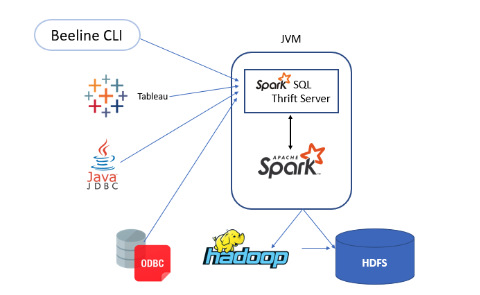

## 10장 Spark SQL
```commandline
- 시스템 함수 사용 및 사용자 정의 함수를 사용할 수 있음
- 워크로드 최적화하기 위해 커리 실행 계획 분석 가능
- DataFrame과 Dataset API와 통합되어있어 SQL 데이터 변환 시 동일한 실행 코드로 컴파일 됨
```
<br/>

### 10.3 빅데이터 SQL: 스파크 SQL
```commandline
- 스파크 2.0 버전은 하이브의 HiveQL을 지원하는 자체 개발 SQL 파서가 포함되어 있음
- 스파크 SQL은 OLTP가 아닌 OLAP로 동작하므로 매우 낮은 지연 시간이 필요한 쿼리 수행에는 맞지 않음

- 스파크와 하이브와의 관계
 ㄴ 하이브 메타스토어는 여러 세션에서 사용할 테이블 정보를 보관하고 있음
 ㄴ 스파크 SQL은 하이브 메타스토어를 사용하므로 하이브와 연동 가능
 ㄴ 하이브 메타스토어에 접속하려면 몇가지 설정값 조정이 필요
```
<br/>

### 10.4 스파크 SQL 쿼리 실행 방법
```commandline
- spark sql cli
 ㄴ ./bin/spark-sql
 
- 예제
spark.read.json("/data/flight-data/json/2015-summary.json")\
  .createOrReplaceTempView("some_sql_view") # DF => SQL

spark.sql("""
SELECT DEST_COUNTRY_NAME, sum(count)
FROM some_sql_view GROUP BY DEST_COUNTRY_NAME
""")\
  .where("DEST_COUNTRY_NAME like 'S%'").where("`sum(count)` > 10")\
  .count() # SQL => DF
  
- Spark SQL Thrift JDBC/ODBC Server
 ㄴ spark Sql을 실행하기 위해 인터페이스로 스파크 드라이버에 접속 가능
 ㄴ HiveServer2에 맞추어 구현이 되어있음
 ㄴ ./sbin/start-thriftserver.sh로 실행
 ㄴ 기본적으로 localhost:10000 주소를 사용
```

<br/>

### 10.5 카탈로그
```commandline
- 테이블에 저장된 메타데이터, 데이터베이스, 테이블, 함수, 뷰에 대한 정보를 추상화
- org.apache.spark.sql.catalog.Catlog 파키지로 사용 가능
- 카탈로그는 테이블, 데이터베이스 , 함수를 조회하는 등 유용한 함수를 제공
- 4장에서 언급했던 카탈로그, 분석기(analyzer)가 테이블/컬럼의 검증을 위해 참조
```
<br/>

### 10.6 테이블
```commandline
- spark 2.0 버전에서 테이블은 항상 데이터를 가지고 있음
- 명령을 실행할 구조라는 점에서 DataFrame과 논리적으로 동일

관리형 테이블 / 외부 테이블 
- 관리형 테이블을 DafaFrame.saveAsTable 메서드를 통해 모든 정보를 저장함
- saveAsTable은 데이터를 스파크포맷으로 변환 후에 새로운 경로에 저장
 * save와 saveAsTable의 차이점은 메타스토어에 메타데이터가 갱신되는가
 * saveAsTable로 설정 후, DF에 컬럼이 추가됐다면 추가된 컬럼이 테이블에 알아서 추가
 
- 데이터 저장경로는 spark.sql.warehouse.dir 속정으로 설정 (기본:/user/hive/warehouse)
- show tables IN databaseName 쿼리를 사용해 데이터베이스의 테이블 확인 가능
```
테이블 생성
```commandline
- Python
spark.read.json("/data/flight-data/json/2015-summary.json")\
  .createOrReplaceTempView("some_sql_view") # DF => SQL
  
- Using문을 이용해 테이블 생성
- 기본 포맷은 Hive SerDe (직렬화 느림)
CREATE TABLE flights_csv (
  DEST_COUNTRY_NAME STRING,
  ORIGIN_COUNTRY_NAME STRING COMMENT "remember, the US will be most prevalent",
  count LONG)
USING csv OPTIONS (header true, path '/data/flight-data/csv/2015-summary.csv')

- 파티셔닝된 데이터 셋으로 테이블 생성
CREATE TABLE partitioned_flights USING parquet PARTITIONED BY (DEST_COUNTRY_NAME)
AS SELECT DEST_COUNTRY_NAME, ORIGIN_COUNTRY_NAME, count FROM flights LIMIT 5
```
테이블에 데이터 삭입
```commandline
- 특정 파티션에만 저장 데이터 저장 가능
INSERT INTO partitioned_flights
  PARTITION (DEST_COUNTRY_NAME="UNITED STATES")
  SELECT count, ORIGIN_COUNTRY_NAME FROM flights
  WHERE DEST_COUNTRY_NAME='UNITED STATES' LIMIT 12
```
테이블 메타데이터
```commandline
DESCRIBE TABLE flights_csv

SHOW PARTITIONS partitioned_flights

REFRESH table partitioned_flights

MSCK REPAIR TABLE partitioned_flights
```
테이블 제거
```commandline
DROP TABLE IF EXISTS flights_csv
```
테이블 캐싱
```commandline
CACHE TABLE flights

UNCACHE TABLE FLIGHTS
```
<br/>

### 10.7 뷰
```commandline
- 뷰 생성, 기존 테이블의 여러 트랜스포메이션 작업을 지정
- 기존 DataFrame에서 새로운 DataFrame을 만드는 작업과 같음
CREATE GLOBAL TEMP VIEW just_usa_global_view_temp AS
  SELECT * FROM flights WHERE dest_country_name = 'United States'
  
- 실행계획 확인가능
EXPLAIN SELECT * FROM just_usa_view

- 뷰 삭제
DROP VIEW IF EXISTS just_usa_view;
```
<br/>

### 10.8 데이터베이스
```commandline
- 데이터베이스를 정의하지 않으면 기본 데이터베이스를 사용함

- 데이터베이스 확인
SHOW DATABASES
- 데이터베이스 생성
CREATE DATABASE some_db
- 데이터베이스 사용
USE some_db
- 데이터베이스 안의 테이블 확인
SHOW tables

- 현재 사용 중인 데이터베이스 확인
SELECT current_database()

- 데이터베이스 제거
DROP DATABASE IF EXISTS some_db
```
<br/>

10.9 select 구문
```commandline
- ANSI-SQL 요건을 충족

- distinct count 문법 가능
spark.sql("SELECT count(distinct DEST_COUNTRY_NAME) from some_sql").show()

- case-when-then 구문
SELECT
    CASE 
        WHEN DEST_COUNTRY_NAME = 'UNITED STATES' THEN 1
        WHEN DEST_COUNTRY_NAME = 'Egypt' THEN 0
        ELSE -1 END
FROM partitioned_flights
```
<br/>

### 10.10 고급 주제
구조체
```commandline
- 아래 구조와 같을 때, 구조체 요소만을 조회
 * SELECT country.DEST_COUNTRY_NAME, count FROM nested_data
+---------------------------+-----+
|country                    |count|
+---------------------------+-----+
|{United States, Romania}   |15   |
|{United States, Croatia}   |1    |
+---------------------------+-----+
```

리스트
```commandline
- 값의 리스트를 만드는 collect_list 함수나, 중복 값이 없는 배열을 만드는 collect_set 함수 사용
SELECT 
    DEST_COUNTRY_NAME as new_name, collect_list(count) as flight_counts,
    collect_set(ORIGIN_COUNTRY_NAME) as origin_set 
FROM 
    flights GROUP BY DEST_COUNTRY_NAME
+--------------------+-------------+---------------+
|            new_name|flight_counts|     origin_set|
+--------------------+-------------+---------------+
|             Algeria|          [4]|[United States]|
|              Angola|         [15]|[United States]|
|            Anguilla|         [41]|[United States]|
| Antigua and Barbuda|        [126]|[United States]|
+--------------------+-------------+---------------+

- 또 다른 배열 생성
SELECT DEST_COUNTRY_NAME, ARRAY(1, 2, 3) FROM flights

- 배열 조회
SELECT DEST_COUNTRY_NAME as new_name, collect_list(count)[0]
FROM flights GROUP BY DEST_COUNTRY_NAME

- explode 함수를 사용해 다시 배열을 여러 로우로 변환
spark.sql("select * from flights_agg").show()
+--------------------+----------------+
|   DEST_COUNTRY_NAME|collected_counts|
+--------------------+----------------+
|             Algeria|             [4]|
|              Angola|            [15]|
|            Anguilla|            [41]|
+--------------------+----------------+
SELECT explode(collected_counts), DEST_COUNTRY_NAME FROM flights_agg
+---+--------------------+
|col|   DEST_COUNTRY_NAME|
+---+--------------------+
|  4|             Algeria|
| 15|              Angola|
| 41|            Anguilla|
+---+--------------------+
```
함수
```commandline
SHOW FUNCTIONS # 전체 함수 목록 확인
SHOW SYSTEM FUNCTIONS # 내장 함수 목록 확인
SHOW USER FUNCTIONS # 사용자 함수 목록 확인
SHOW FUNCTIONS "s*"; # 함수 목록 확인시 조건

- 사용자 함수
def power3(number:Double):Double = number * number * number
spark.udf.register("power3", power3(_:Double):Double)
SELECT count, power3(count) FROM flights
```
서브쿼리 
```commandline
- 상호 연관 서브쿼리 ( correlated subquery )
- 내부 쿼리에서 외부 범위에 있는 정보를 사용할 수 있음
- 예제
SELECT * 
FROM flights f1
WHERE EXISTS (
    SELECT 1 
    FROM flights f2
    WHERE f1.dest_country_name = f2.origin_country_name
) AND EXISTS (
    SELECT 1 
    FROM flights f2
    WHERE f2.dest_country_name = f1.origin_country_name
)

- 비상호연관 서브쿼리 ( uncorrelated subquery )
- 쿼리 외부 범위에 있는 어떤 관련 정보도 사용하고 있지 않고, 독자적으로 실행 가능
- 예제
SELECT * 
FROM flights
WHERE origin_country_name IN (
    SELECT dest_country_name 
    FROM flights
    GROUP BY dest_country_name 
    ORDER BY sum(count) DESC LIMIT 5
)
```
