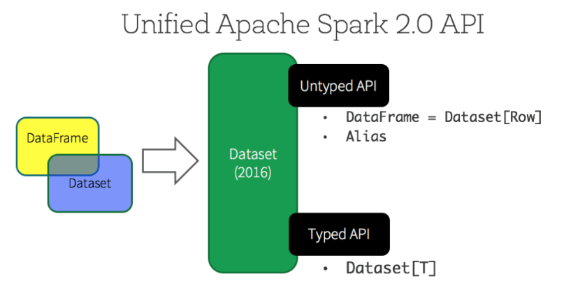

## 11장 Dataset
```commandline
DataFrame
- 스파크 1.3에서 처리 속도 증가를 위해 추가 됨
- 데이터를 스키마 형태로 추상화 하고, 카탈리스트 옵티마이저가 쿼리를 최적화하여 처리합니다.
- DataFrame 또한 row 타입의 DataSet
  ㄴ row type 참조 : https://spark.apache.org/docs/latest/api/java/org/apache/spark/sql/Row.html

DataSet
- 스파크 1.6에서 추가  
- 데이터의 타입체크, 데이터 직렬화를 위한 인코더, 카탈리스트 옵티마이저를 지원하여 데이터 처리 속도를 더욱 증가
- jvm 을 이용하는 언어인 스칼라와 자바에서만 사용할 수 있음
- 스칼라나 자바를 사용할 때 모든 DataFrame은 Dataset을 의미

- 스칼라에서는 스키마가 정의된 케이스 클래스 객체를 이용해 DataSet을 정의
- 자바에서는 자바빈 객체를 이용해 DataSet을 정의
- 인코더는 도메인별 특정 객체 T 를 스파크 내부 데이터타입으로 매핑하는 시스템을 의미
  ㄴ 데이터셋에 접근할 때마다 Row 포맷이 아닌 사용자 정의 데이터타입으로 반환
  
  
RDD는 SparkContext를 이용하고, DataFrame, DataSet SparkSession 객체를 이용
Spark 2.0에서는 DataFrame API가 Dataset API와 합쳐짐
SQL과 DataSet, DataFrame을 이용한 처리는 동일한 엔진을 이용하기 때문에 편리한 API를 이용
참고 : https://spark.apache.org/docs/latest/sql-programming-guide.html
```

<br/>

### 11.1 Dataset을 사용할 시기
```commandline
Dataset을 사용해야하는 이유
- DataFrame 기능만으로는 수행할 연산을 표현할 수 없을 때
- 성능 저하를 감수하더라도 타입 안정성(type-safe)을 가진 데이터타입을 사용할 경우

예시)
- 복잡한 비즈니스 로직을 단일 함수로 인코딩해야하는 경우
- 정확도와 방어적 코드가 속도보다 중시될 때 (문자열의 뺄셈의 정의하는 함수)
```
<br/>

### 11.2 Dataset 생성
```commandline
- 정의할 스키마를 미리 알고 있어야 함
- 자바에서 데이터 타입 클래스를 정의한 다음 Dataset<Row> 지정해 인코딩

import org.apache.spark.sql.Encoders;

public class Flight implements Serializable {
    string DEST_COUNTRY_NAME;
    string ORIGIN_COUNTRY_NAME;
    long DEST_COUNTRY_NAME;
}

Dataset<Flight> flights = spark.read.parquet("/data/aaa.parquet/")
    .as(Encoders.bean(Flight.class));
```
<br/>

### 11.4 트랜스포메이션
```commandline
- Dataset의 트랜스포메이션은 DataFrame과 동일

- 필터링
def originIsDestination(flight_row: Flight): Boolean = {
  return flight_row.ORIGIN_COUNTRY_NAME == flight_row.DEST_COUNTRY_NAME
}
flights.filter(flight_row => originIsDestination(flight_row)).first()

매핑 - 트랜스포메이션
val destinations = flights.map(f => f.DEST_COUNTRY_NAME)
```
<br/>

### 11.5 조인
```commandline
- 조인은 DataFrame과동일하지만 joinWith처럼 정교한 메서드 제공
- 각 컬럼은 단일 Dataset 처럼 다룰 수 있어 조인 수행시 더 많은 정보를 다를 수 있음

case class FlightMetadata(count: BigInt, randomData: BigInt)

val flightsMeta = spark.range(500).map(x => (x, scala.util.Random.nextLong))
  .withColumnRenamed("_1", "count").withColumnRenamed("_2", "randomData")
  .as[FlightMetadata]

val flights2 = flights
  .joinWith(flightsMeta, flights.col("count") === flightsMeta.col("count"))
```
<br/>

### 11.6 그룹화 집계
```commandline
- groupBy, rollup, cube 메서드를 여전히 사용 가능

flights.groupByKey(x => x.DEST_COUNTRY_NAME).count()
```
<br/>