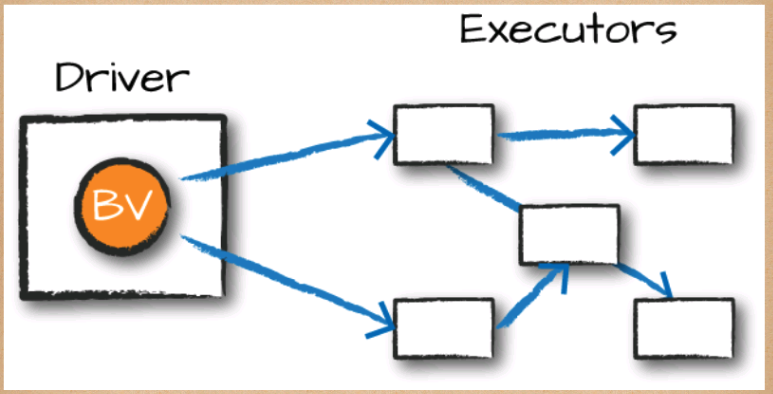
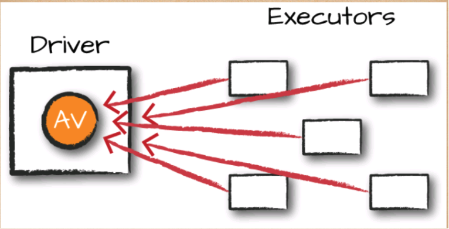

## 14장 분산형 공유 변수
```commandline
- 스파크 저수준 API는 RDD외에도 분산형 공유 변수가 있음
- 분산형 공유 변수는 브로드캐스크 변수 / 어큐뮬레이터 라는 두개의 타입이 존재
```
<br/>

### 14.1 브로드캐스트 변수
```commandline
- 모든 워커 노드에 큰 값을 저장하여 재전송 없이 많은 스파크 액션을 재사용
- 브로드캐스트 변수는 클러스터의 모든 워커 노드에 큰 데이터를 효율적으로 공유하기 위해 사용
- 일반적으로 읽기 전용 변수로 사용되며, 각 노드에 한 번만 전송되므로 네트워크 비용을 절감


- 브로드캐스트할 구조체 변수 생성
supplementalData = {"Spark":1000, "Definitive":200,
                    "Big":-300, "Simple":100}
suppBroadcast = spark.sparkContext.broadcast(supplementalData)

- 변수의 value 메서드를 사용해 값을 참조
suppBroadcast.value

- 브로드캐스트 변수 사용
words.map(lambda word: (word, suppBroadcast.value.get(word, 0)))\
  .sortBy(lambda wordPair: wordPair[1]).collect()
  

- 변수 공유라는 차원에서 브로드캐스트 변수와 클래스 메소드의 차이점
브로드캐스트 변수: 
Spark의 클러스터 전체에 큰 데이터를 효율적으로 공유하기 위한 메커니즘 
한 번만 네트워크를 통해 전송되고 각 워커 노드에서 읽기 전용으로 사용할 수 있습니다.
클래스 메소드: 
각 워커 노드에 데이터가 복사되므로 브로드캐스트 변수만큼 효율적이지 않음
```

<br/>

### 14.2 어큐뮬레이터
```commandline
- 모든 테스크의 데이터를 공유 결과에 추가
- 트랜스포메이션 내부의 다양한 값을 갱신/추적하는데 사용
 - Ex) 파티션별로 특정 변수의 값을 디버깅
- 액션을 처리하는 과정에서만 갱신


- 어큐뮬레이터 예제
accumulator = spark.sparkContext.accumulator(0)

# RDD에서 어큐뮬레이터 사용
rdd = spark.sparkContext.parallelize([1, 2, 3, 4, 5])

def map_function(value):
    global accumulator
    accumulator.add(value) # 어큐뮬레이터 값 증가
    return value
result = rdd.map(map_function).collect()

# 결과 출력
print(result)  # [1, 2, 3, 4, 5]
print("Accumulator value:", accumulator.value)  # Accumulator value: 15


- 로그파일에서 에러 확인 누적 예제
# 어큐뮬레이터 생성
error_count = spark.sparkContext.accumulator(0)

# RDD 생성
log_rdd = spark.sparkContext.textFile("hdfs://path_to_log_files")

def count_errors(line):
    global error_count
    if "ERROR" in line:
        error_count.add(1)

# RDD 처리
log_rdd.foreach(count_errors)

# 최종 어큐뮬레이터 값 출력
print(f"Total number of errors: {error_count.value}")
```

<br/>