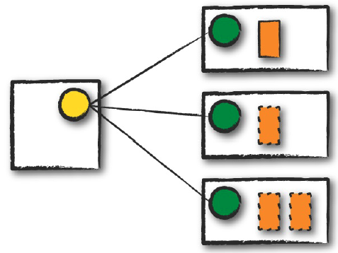
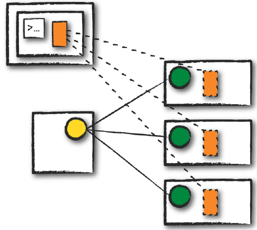

## 15장 클러스터에서 스파크 실행하기


### 15.1 스파크 애플리케이션의 아키텍처
```commandline
스파크 드라이버
- 드라이버는 스파크 애플리케이션의 실행을 제어하고 상태 정보(익스큐터 상태 및 태스크)를 유지
- 물리적 컴퓨팅 자원 확보
- 클러스터 매니저와 통신

스파크 익스큐터
- 익스큐터는 스파크 드라이버가 할당한 태스크를 수행하는 프로세스
- 태스크를 수행하고 태스크의 상태를(성공 및 실패)를 드라이버에 보고

클러스터 매니저
- 클러스터 매니저는 스파크 애플리케이션을 실행할 클러스터 머신을 유지
- 스파크가 실행될 때 클러스터 매니저에 자원할당을 요청
- 클러스터 매니저는 '마스터'와 '워커'의 개념이 있음
- 개별 워커노드를 실행하는 데몬 프로세스
- 스파크가 지원하는 클러스터 매니저
 ㄴ standalone cluster manager
 ㄴ apache mesos
 ㄴ hadoop yarn
```
<br/>


### 15.1.1 실행 모드
실행 모드는 애플리케이션을 실행할 때 요청한 자원의 물리적인 위치를 결정
```commandline
클러스터 모드
- 클러스터 매니저는 스파크 실행 파일을 워커 노드에 드라이버와 익스큐터 프로세스를 실행

클라이언트 모드
- 실행 파일을 제출한 클라이언트 머신에 스파크 드라이버가 위치
- 드라이버는 클러스터 외부의 머신에서 실행, 나머지 워커는 클러스터에 위치
- 위의 클라이언트를 에지 노드(edge node)라고 부름

로컬 모드
- 모든 스파크 애플리케이션이 단일 머신에서 실행
- 병렬 처리를 위해 단일 머시느이 스레드를 활용
```
<br/>

```commandline
실선 직사각형 - 스파크 드라이버 프로세스
점선 직사각형 - 익스큐터 프로세스
```

#### 클러스터 모드


#### 클라이언트 모드



### 15.2 스파크 애플리케이션의 생애주기(외부)
```commandline
클라이언트 요청
- 스파크 애플리케이션이 시작 될 때, 드라이버 프로세스 자원과 코드 실행을 요청
- 클러스터 매니저는 해당 요청을 통해 노드 중에 하나에 드라이버 프로세스 실행
- 스파크 잡을 제출한 클라이언트 프로세스 종료

시작
- 드라이버 프로세스가 사용자 코드 실행시, SparkSession을 통해 익스큐터 프로세스를 실행 (설정값 지정 및 초기화)
- SparkSession은 클러스터 매니저와 통신하고, 이를 통해 클러스터 매니저가 클러스터 노드에 익스큐터 실행-결과를 반환

실행
- 스파크 클러스터가 생성되어 코드(main())를 실행
- 드라이버와 다른 워커(노드의 익스큐터)와 통신하며, 드라이버는 각 워커에 태스크를 할당함

완료
- 스파크 완료가 되면 드라이버 프로세스가 성공 혹은 실패 중 하나의 상태로 종료
- 모든 익스큐터 종료
```

### 15.3 스파크 애플리케이션의 생애주기(내부)
```commandline
SparkSession
- 스파크 코드를 실행하기 위해 사용

SparkContext
- 스파크 클러스터에 대한 연결을 나타냄
- RDD 같은 저수준의 API 사용
- SparkSession을 통해 미리 선언 및 접근 할 수 있으므로 명시적으로 초기화할 필요 없음
- getOrCreate 메서트로 직접 초기화 가능, EX) val cs = SparkContext.getOrCreate()

논리적 명령을 물리적 실행 계획으로 변환
- spark 코드 실행으로 collect 액션이 개별 스테이지와 테스크로 이루어진 스파크잡이 실행됨을 확인
- /example/15_1.py 확인

스파크 잡
- 액션 하나당 하나의 스파크 잡이 생성
- 스파크 잡은 스테이지로 나뉘며 스테이지 수는 셔플 작업이 얼마나 발생하는지에 따라 달라짐
- 스파크 잡은 클러스터의 여러 익스큐터에서 병렬로 실행 됨

스테이지
- spark.sql.shuffel.partitions 을 통해 셔플파티션 기본 생성값(default 200) 변경 가능
- 익스큐터 수보다 파티션수를 크게 지정

스테이지 특징
1.단계별 분할
    - 스테이지(Stage)는 작업의 실행 계획을 단계별로 나눈 것을 의미
    - 다수의 머신에서 동일한 연산을 수행하는 태스크의 그룹
    - 각 단계는 데이터 셔플(shuffle)이 발생하는 지점을 기준으로 생성
    - 데이터 셔플이 발생하지 않는 일련의 연산은 하나의 단계로 구성
    - 셔플은 데이터 물리적 재분해
2. 병렬 실행
    - 각 스테이지는 독립적으로 실행될 수 있으며, 여러 익스큐터에서 병렬로 실행
    - 스파크는 가능한한 많은 스테이지를 병렬로 실행하여 처리 성능을 극대화하려고 시도
3. 최적화
    - 스파크는 스테이지의 실행 계획을 최적화하여 성능을 향상 
    - 데이터 셔플링 최소화, 중간 결과 재사용 등이 포함
4. 장애 처리:
    - 스파크는 스테이지의 장애 처리를 지원 (특정 스테이지의 태스크가 실패하면 스테이지의 재실행을 수행하여 오류를 복구)
    
태스크
- 스테이지는 태스크로 구성됨
- 태스크는 파티션에 적용되는 연산 단위 ( 100개의 파티션은 100개의 태스크로 병렬로 실행 )
```

15.4 세부 실행 과정
```commandline
파이브라이닝
- RDD나 RDD보다 더 아래에서 발생하는 파이프라이닝 기법으로 최적화
- 노드 간의 데이터 이동 없이 내부의 연산만을 모아 태스크를 단일 스테이지로 만듬
- 연속된 작업처리로 인해 작업의 대기시간과 메모리 사용량을 감소
- 스파크 런타임에서 파이프라이닝을 자동으로 수행

셔플 결과 저장
- 셔플 퍼시스턴스(Shuffle Persistence)는 셔플 단계에서 생성된 중간 결과를 디스크에 저장하여 재사용하는 기능을 의미
- 셔플 퍼시스턴스는 스파크 애플리케이션의 성능을 향상시키고 재계산 비용을 줄이는 데 도움
- 네트워크를 통한 익스큐터 간의 데이터 이동이 크게 감소합니다.

셔플 퍼시스턴스 구성 옵션
- 디스크 기반 셔플 퍼시스턴스: 셔플 결과를 디스크에 저장, 메모리를 절약
- 메모리 기반 셔플 퍼시스턴스: 셔플 결과를 메모리에 저장, 빠른 데이터 접근이 가능하므로 처리 속도가 향상, 메모리 부족 오류가 발생
```
