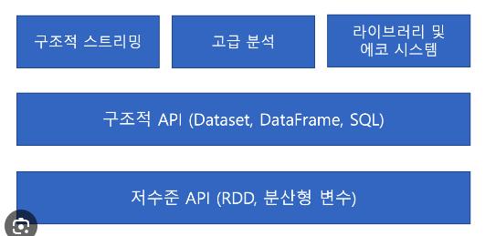
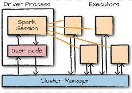

## 1장 아파치 스파크란

### 스파크 기능 구성


### 컴퓨팅 엔진
```commandline
- 스파크는 저장소 시스템의 데이터를 연산하는 역할을 수행
- 영구 저장소 역할은 수행하지 않으며 대신에 AWS S3, Hadoop, 카산드라, 카프카 등의 저장소를 지원
```

### 스파크 설치하기

```commandline
# homebrew로 설치 ( MAC )
brew install apache-spark

# spark 경로 확인
brew info apache-spark

# spark version 확인
spark-submit --version

# spark shell 실행 
pyspark
spark-shell
```
파이썬 콘솔 실행하기
SQL 콘솔 실행하기


## 2장 스파크 간단히 살펴보기

### 2.1 스파크 기본 아키텍처
```commandline
클러스터
- 클러스터는 여러 컴퓨터의 자원을 모아 하나의 컴퓨터 처럼 사용
- 스파크는 클러스터에서 작업을 조율할 수 있는 역할을 하는 프레임워크
```

```commandline
드라이버 프로세스
- 클러스터 노드 중 하나에서 실행되며 main() 함수를 실행
- 필수적으로 존재

익스큐터 프로세스
- 드라이버가 할당한 작업을 수행 후, 드라이버 노드에 보고하는 두가지 역할 수행
```


클러스터 모드 실행 예제
```commandline
from pyspark.sql import SparkSession

spark = SparkSession.builder \
    .appName("MySparkApp") \  # 애플리케이션 이름 설정
    .master("spark://<master-hostname>:<master-port>") \  # 마스터 노드의 주소 설정
    .config("spark.executor.instances", "4") \  # 실행할 Executor 인스턴스 수 설정
    .config("spark.executor.cores", "4") \  # 각 Executor의 코어 수 설정
    .getOrCreate()
```

클라이언트 모드 실행 예제
```commandline
from pyspark.sql import SparkSession

spark = SparkSession.builder \
    .appName("MySparkApp") \ 
    .master("local[1]") \  # 로컬 머신에서 실행
    .config("spark.executor.instances", 3) \  # 실행할 Executor 인스턴스 수 설정
    .config("spark.executor.cores", 1) \  # 각 Executor의 코어 수 설정
    .getOrCreate()
```

Hive Thirft 서버 클러스터 모드
```commandline
from pyspark.sql import SparkSession

spark = SparkSession.builder \
    .appName("MySparkApp") \  # 애플리케이션 이름 설정
    .config("spark.sql.warehouse.dir", "hdfs://<namenode>:<port>/user/hive/warehouse") \  # Hive warehouse 경로 설정
    .config("spark.hadoop.hive.metastore.uris", "thrift://<metastore-host>:<port>") \  # Hive metastore 주소 설정
    .config("spark.executor.instances", 3) \  # 실행할 Executor 인스턴스 수 설정
    .config("spark.executor.cores", 1) \  # 각 Executor의 코어 수 설정
    .enableHiveSupport() \  # Hive 지원 활성화
    .getOrCreate()
```

### 2.3 스파크 API
```commandline
스파크는 두 가지 API를 제공

저수준의 비구조적 API 
ㄴ RDD
ㄴ 저수준의 API는 데이터에 대한 세부적인 제어를 제공, 그러나 직접적으로 분산, 병렬 처리 및 메모리 관리가 필요
ㄴ map(), filter(), reduce()와 같은 연산자를 사용

고수준의 구조적 API 
ㄴ DataFrame 및 Dataset API
ㄴ 스키마를 가지고 있어 데이터의 구조와 타입을 명확하게 정의, 최적화된 실행 계획이 가능
ㄴ SQL과 유사한 문법을 사용하여 데이터를 처리 가능
ㄴ select(), filter(), groupBy(), agg()와 같은 함수를 사용하여 데이터를 조작 및 집계
```

### 2.5 SparkSession
```commandline
- Apache Spark를 사용하여 작업을 수행하는 데 사용되는 주요 객체
- SparkSession 인스턴스는 사용자가 정의한 명령을 클러스터에서 실행
- 하나의 SparkSession은 하나의 스파크 애플리케이션에 대응


- SparkSession과 SparkContext의 차이점

SparkContext:
ㄴ Spark 1.x 시절부터 사용되던 주요 진입점(entry point) 객체
ㄴ 클러스터와의 연결을 설정하고 RDD(Resilient Distributed Dataset)를 생성하고 조작하는 데 사용
ㄴ 주로 하위 수준의 API를 다루는 데 사용

SparkSession:
ㄴ Spark 2.x 버전부터 도입된 새로운 진입점(entry point) 객체
ㄴ 데이터프레임(DataFrame)과 데이터셋(Dataset) API를 사용하여 구조적인 데이터를 다루는 데 사용
ㄴ SparkSession은 SparkContext와 SQLContext, HiveContext를 하나의 객체로 통합 됨
ㄴ Spark SQL, 스트리밍 처리 등 다양한 기능을 사용할 수 있도록 합니다.
```

### 2.6 DataFrame
```commandline
DataFrame
- 가장 대표적인 구조적 API
- 테이블의 데이터를 row, column으로 표현 ( 스키마 )
- 분산 데이터를 표현하기에 효율적인 구조

Partition
- 모든 익스큐터가 병렬로 작업을 수행할 수 있도록 파티션이라는 청크 단위로 데이터를 분할
- 파티션은 클러스터의 여러 노드에 분산되어 저장되며, 병렬 처리 작업을 수행할 때 각 파티션은 별도의 태스크로 실행
- 클러스터의 물리적 머신에 존재하는 row의 집합, 분산된 데이터의 조각
```

### 2.7 트랜스포메이션
```commandline
트랜스포메이션
- 스파크의 핵심 데이터구조는 불변성 (immutable)
- 불변성이기이에 트랜스포메이션을 통해(액션 이전에) 데이터를 변환하거나 조작하는 작업을 의미 


트랜스포메이션 유형

- 좁은 의존성
ㄴ 하나의 파티션이 하나의 출력 파티션에만 영향

- 넓은 의존성
ㄴ 하나의 파티션이 여러 출력 파티션에 영향
ㄴ 파티션을 교환하는 셔플이 발생


트랜스포메이션은 특성
- 지연 연산
ㄴ 스파크는 트랜스포메이션을 즉시 실행하지 않고, 논리적 실행 계획을 만들어 DAG(Directed Acyclic Graph)를 생성
ㄴ DAG에는 연산들 사이의 의존성과 실행 순서가 정의됩
ㄴ DAG가 생성 후, 스파크는 DAG를 물리적 실행 계획으로 컴파일
ㄴ 이는 DAG의 각 단계를 실제로 실행할 수 있는 실행 단위로 변환하는 과정
ㄴ 물리적 실행 계획은 실제로 클러스터에서 실행될 태스크들을 나타 냄 ( 데이터의 파티션 처리, 클러스터의 자원 할당, 셔플 및 병렬 처리 등을 고려하여 구성 )
ㄴ 물리적 실행 계획은 최적화된 실행 경로를 선택하여 클러스터에서의 작업을 효율적으로 수행할 수 있도록 지원

- 병렬 처리
ㄴ 트랜스포메이션은 병렬로 처리 됨 ( 여러 파티션의 데이터에 동시에 적용 됨 ) 
```