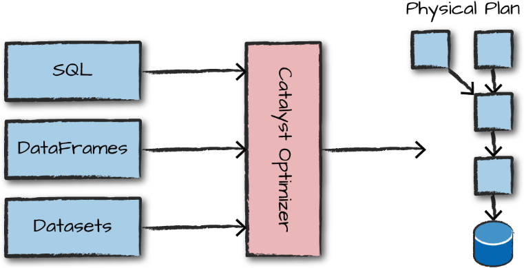
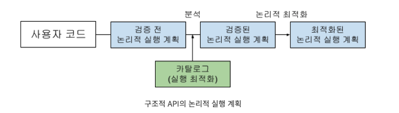
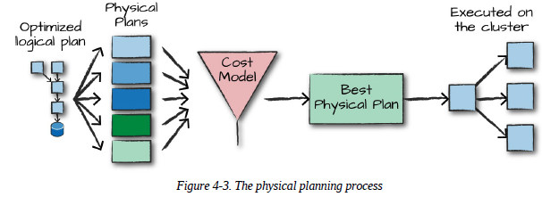

## 4장 구조적 API 개요

```commandline
구조적 API에는 3가지 분산 컬렉션 API가 있음
- Dataset
- DataFrame
- SQL Table & View

3가지 핵심 개념
- 타입형 / 비타입형 API 개념과 차이점
- 핵심용어
    ㄴ 카탈리스트 / 카탈로그 / 실행 계획 / 조건절 푸쉬 다운
- 스파크가 구조적 API의 데이터 흐름을 해석하고 클러스터에서 실행하는 방식
```

### 4.1 DataFrame과 Dataset
```commandline
- DataFrame과 Dataset은 잘 정의된 로우와 컬럼을 가지는 분산 테이블 형태의 컬렉션
- 값 없음은 null 로 표시
```

### 4.2 스키마
```commandline
- 스키마는 DataFrame의 컬럼명과 데이터 타입을 지정
- 스키마는 데이터소스에서 얻거나 (schema on read) 직접 정의
```

### 4.3 스파크의 구조적 데이터 타입 개요
```commandline
- 데이터 타입 정보를 가지고 있는 카탈리스트(Catalyst) 엔진을 사용
- 스파크는 자체 타입을 지원하는 여러 언어 API와 직접 맵핑되며 각 언어에 대한 맵핑 테이블을 가지고 있음
- 따라서 여러 언어로 Spark 프로그래밍 가능

DataFrame과 Dataset 비교
- 구조적 API에는 비타입형인 DataFrame과 타입형이 Dataset 
- 비타입형은 스키마에 명시된 데이터 타입 일치 여부를 '런타임' 때 확인
- 타입형은 스키마에 명시된 데이터 타일 이치 여부를 '컴파일 타임' 때 확인

- DataFrame은 Row 타입으로 구성된 Dataset
- Dataset은 scala(case class)나 java(javaBean)을 사용해야 함


로우 ( Row )
- 연산에 최적화된 인메모리 포맷
- 로우는 데이터 레코드이며 SQL, RDD, 데이터소스에서 얻거나 직접 만듬
- Ex. spark.range(2).collect()

스파크 데이터 타입
- 파이썬은 데이터 타입과 관련된 제약사항이 있음
```

### 4.4 구조적 API의 실행 과정
```commandline
단계
1. DataFrame/Dataset/SQL 이용해 코드를 작성 ( 카탈리스트 옵티마이저로 구조적 API )
2. 논리적 실행 계획으로 변환
3. 논리적 실행 계획을 물리적 실행 계획으로 변환, 추가적인 최적화를 할 수 있는지 확인
4. 스파크는 클러스터에서 물리적 실행 계획(RDD 처리)를 실행
```

카탈리스트 옵티마이저 
```commandline
- 카탈리스트 옵티마이저(Catalyst Optimizer)는 Apache Spark의 쿼리 실행 엔진
- 코드를 넘겨받고 실제 실행 계획을 생성함
- DataFrame API나 SQL 쿼리를 실행할 때 사용되며, 쿼리의 논리적 및 물리적 실행 계획을 최적화하는 역할을 하는 규칙의 모음


주요 기능

논리적 최적화(Logical Optimization):
- 사용자가 작성한 쿼리나 DataFrame의 연산을 파싱하고 논리적 트리(Logical Plan)로 변환
- 논리적 트리를 분석하여 최적화할 수 있는 방법을 적용
- 예를 들어, 필요하지 않은 연산을 제거하거나 조인 순서를 변경하여 성능을 개선

물리적 최적화(Physical Optimization):
- 논리적 최적화된 트리를 물리적 실행 계획(Physical Plan)으로 변환
- 각 논리적 연산에 대해 가장 효율적인 물리적 연산 방법을 선택
- 예를 들어, 적절한 조인 알고리즘을 선택하거나 인덱스를 활용하여 데이터를 스캔
- 물리적 실행 계획의 각 단계에서 적절한 파티션 수 및 크기를 결정

쿼리 최적화(Query Optimization):
- 다양한 쿼리 최적화 기법을 사용하여 전체 쿼리의 성능을 최적화
- 예를 들어, 필터링 조건을 푸시 다운하거나 불필요한 데이터 이동을 최소화할 수 있습니다.
```

<br/><br/>

#### 4.4.1 논리적 실행 계획
```commandline
- 논리적 실행 계획 단계에서는 추상적 트랜스포메이션만 표현 (드라이버, 익스큐터 고려 x )
- 검증 전 논리적 실행 계획(unresolved logical plan)으로 변환, 코드의 유효성과 테이블/컬럼 존재 여부만을 판단
- 분석기(analyzer)는 테이블/컬럼의 검증을 위해 카탈로그 및 테이블저장소, DataFrame 정보를 활용
- 테이블/컬럼의 검증 결과는 카탈리스트 옵티마이저로 전달되어 실행 계획을 최적화 한다.
    ㄴ 조건절 푸쉬 다운(predicate pushing down)이나 선택적 구문 등

    
* 조건절 푸쉬 다운 이란?

- 조건절 푸시 다운은 필터링 조건을 최대한 초기 단계로 이동시켜 데이터 읽기 연산이 필요한 데이터의 양을 최소화합니다.
- 스파크SQL이나 데이터프레임 API를 사용하는 경우에 적용됩니다.

- 조건절 푸시 다운의 예시
    ㄴ 데이터베이스 내 필터링: 스파크SQL로 작성된 쿼리가 데이터베이스에 대한 필터링을 포함하는 경우, 데이터베이스 쿼리로 해당 필터를 전달
    ㄴ 파티션 프루닝: 데이터가 파티션된 경우, 스파크는 쿼리에서 필터링 조건을 파티션 키와 일치하는 파티션에 적용하여 필요한 파티션만 읽음
    ㄴ 프로젝션 푸시 다운: 스파크는 쿼리에서 필요한 컬럼만을 데이터 소스로부터 읽을 수 있도록 최적화합니다.
```

<br/><br/>

#### 4.4.2 물리적 실행 계획
```commandline
- 논리적 실행계획을 클러스터 환경에서 실행하는 방법을 정의
- 예를 들어 사용하려는 테이블의 크기나 파티션 수에 따른 조인 연산의 비용을 계산하여 비교
- DataFrame/Dataset/SQL로 정의된 쿼리를 RDD와 트랜스포메이션으로 컴파일 함
```

<br/><br/>

#### 4.4.3 실행
```commandline
- 물리적 실행 계획 선정 후에 저수준 인터페이스 RDD를 대상으로 모든 코드를 실행
```