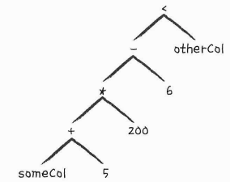

## 5장 구조적 API 기본 연산

```commandline
- DataFrame은 Row 타입의 레코드와 연산 여러 컬럼으로 구성
- 스키마는 각 컬럼명과 데이터의 타입을 정의
- 파티셔닝은 DataFrame이나 Dataset이 클러스터에서 물리적으로 배치되는 형태를 정의

- 예제를 위한 DataFrame 생성
df = spark.read.format('json').load('/Users/myname/Test/Spark_ref/sparkGuide/data/2015-summary.json')
df.printSchema()
root
 |-- DEST_COUNTRY_NAME: string (nullable = true)
 |-- ORIGIN_COUNTRY_NAME: string (nullable = true)
 |-- count: long (nullable = true)
```
<br/>

### 5.1 스키마
```commandline
- 스키마는 여러개의 StructField 타입 field로 구성된 StrctType 객체
- 런타임에서 데이터타입이 스키마타입과 일치하지 않으면 오류를 발생 

- 스키마 온 리드
df = spark.read.format('json').load('/Users/myname/Test/Spark_ref/sparkGuide/data/2015-summary.json').schema
>>> 
StructType([
    StructField('DEST_COUNTRY_NAME', StringType(), True), 
    StructField('ORIGIN_COUNTRY_NAME', StringType(), True), 
    StructField('count', LongType(), True)
])

- 스키마 직접 정의 ( example/4_1_스키마직접정의.py )
myManualSchema = StructType([
    StructField('DEST_COUNTRY_NAME', StringType(), True),
    StructField('ORIGIN_COUNTRY_NAME', StringType(), True),
    StructField('count', LongType(), False, metadata={"hello":"world"})
])
df = spark.read.format("json").schema(myManualSchema).load('/Users/myName/Test/Spark_ref/sparkGuide/data/2015-summary.json') 
```
<br/>

### 5.2 컬럼과 표현식
```commandline
- 컬럼은 표현식을 사용해 값을 나타내는 논리적은 구조, 데이터를 얻기 위해선 Row(DataFrame)가 필요 
- 표현식은 DataFrame 레코드의 여러 값에 대한 트랜스포메이션 집합
- 컬럼과 트랜스포메이션은 논리적 실행 계획(논리적 트리)으로 컴파일 됨
- 예제 
from pyspark.sql.functions import expr
expr("(((someCol + 5) * 200 )- 6) < otherCol")
```


```commandline
- 명시적 컬럼 참조시 >>> df["count"]
- 컬럼의 전체 정보 확인 >>> df.columns
```
<br/>

### 5.3 레코드와 로우
```commandline
- DataFrame에서 로우는 하나의 레코드
- 로우 생성 예제
from pyspark.sql import Row
myRow = Row("hollw", None, 1, False)
myRow[0]
>> 'hollw'
myRow[2]
>> 1
```
<br/>


### 5.4 DataFrame의 트랜스포메이션

#### 5.4.1 DataFrame 생성 
```commandline
- 파일을 통해 생성
df = spark.read.format("json").load("/Users/myname/Test/Spark_ref/SparkGuide/data//2015-summary.json")
df.createOrReplaceTempView("dfTable")

- Row 객체를 가진 Seq 타입을 직접 변환해 생성
from pyspark.sql import Row
from pyspark.sql.types import StructField, StructType, StringType, LongType
myManualSchema = ([
    StructField("some", StringType(), True),
    StructField("col", StringType(), True),
    StructField("name", LongType(), False)
])
myRow = Row("Hello", None, 1)
myDf = spark.createDataFrame([myRow], myManualSchema)
myDf.show()
```
<br/>

#### 5.4.2 select / selectExpr
```commandline
- select / selectExpr 메서드를 사용하면 테이블에 SQL을 실행하는 것처럼 DataFrame에서도 SQL사용
df.select("DEST_COUNTRY_NAME").show(2)

- expr 메서드 조합
from pyspark.sql.functions import expr
df.select(expr("DEST_COUNTRY_NAME as des")).show(2)
+-------------+
|          des|
+-------------+
|United States|
|United States|
+-------------+

- selectExpr 메서드는 유효한 비집계형 SQL 구문을 지정할 수 있다.
df.selectExpr("*", "DEST_COUNTRY_NAME AS des", "(DEST_COUNTRY_NAME = ORIGIN_COUNTRY_NAME) as within").show(2)
+-----------------+-------------------+-----+-------------+------+
|DEST_COUNTRY_NAME|ORIGIN_COUNTRY_NAME|count|          des|within|
+-----------------+-------------------+-----+-------------+------+
|    United States|            Romania|   15|United States| false|
|    United States|            Croatia|    1|United States| false|
+-----------------+-------------------+-----+-------------+------+

- DataFrame 컬럼에 대한 집계 함수 지정
df.selectExpr("avg(count)", "count(distinct(DEST_COUNTRY_NAME))").show(2)
+-----------+---------------------------------+
| avg(count)|count(DISTINCT DEST_COUNTRY_NAME)|
+-----------+---------------------------------+
|1770.765625|                              132|
+-----------+---------------------------------+
```
<br/>

#### 5.4.3 스파크 데이터 타입으로 변환하기
```commandline
- 명시적인 상수값을 lit()을 통해 전달
from pyspark.sql.functions import lit
df.select(expr("*"), lit(10).alias("One")).show()
```
<br/>

#### 5.4.4 컬럼 추가하기
```commandline
- withColumn 메서드는 사용
df.withColumn("numberOne", lit(1)).show(2)
+-----------------+-------------------+-----+---------+
|DEST_COUNTRY_NAME|ORIGIN_COUNTRY_NAME|count|numberOne|
+-----------------+-------------------+-----+---------+
|    United States|            Romania|   15|        1|
|    United States|            Croatia|    1|        1|
+-----------------+-------------------+-----+---------+

- 출발지와 도착지가 같은 여부를 가리는 컬럼 추가
df.withColumn("within", expr("ORIGIN_COUNTRY_NAME == DEST_COUNTRY_NAME")).show(2)
+-----------------+-------------------+-----+------+
|DEST_COUNTRY_NAME|ORIGIN_COUNTRY_NAME|count|within|
+-----------------+-------------------+-----+------+
|    United States|            Romania|   15| false|
|    United States|            Croatia|    1| false|
+-----------------+-------------------+-----+------+
```
<br/>

#### 5.4.5 컬럼명 변경하기
```commandline
- withColumnRenamed 메서드 사용
df.withColumnRenamed("DEST_COUNTRY_NAME", "dest").columns
```
<br/>

#### 5.4.8 컬럼제거하기
```commandline
df.drop("ORIGIN_COUNTRY_NAME").columns
```