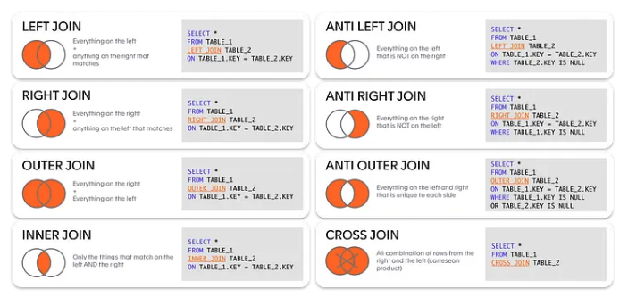

## 8장 조인

### 8.1 조인 표현식
```commandline
- 스파크는 왼쪽과 오른쪽 데이터셋에 있는 하나 이상의 키값을 비교하여 데이터셋을 조인 함
- 스파크는 일치하하는 키가 없는 로우는 조인에 포함시키지 않음
```
<br/>

### 8.2 조인 타입
```commandline
- inner join
- outer join 
- left outer join 
- right outer join
- left semi join
- left anti join
- natural join
- cross join
```

<br/>

```commandline
- 예제를 위한 Data 생성

person = spark.createDataFrame([
    (0, "Bill Chambers", 0, [100]),
    (1, "Matei Zaharia", 1, [500, 250, 100]),
    (2, "Michael Armbrust", 1, [250, 100])])\
  .toDF("id", "name", "graduate_program", "spark_status")
graduateProgram = spark.createDataFrame([
    (0, "Masters", "School of Information", "UC Berkeley"),
    (2, "Masters", "EECS", "UC Berkeley"),
    (1, "Ph.D.", "EECS", "UC Berkeley")])\
  .toDF("id", "degree", "department", "school")
sparkStatus = spark.createDataFrame([
    (500, "Vice President"),
    (250, "PMC Member"),
    (100, "Contributor")])\
  .toDF("id", "status")
  
person.createOrReplaceTempView("persom")
graduateProgram.createOrReplaceTempView("graduateProgram")
sparkStatus.createOrReplaceTempView("sparkStatus")
```
<br/>

### 8.3 내부 조인
```commandline
joinExpression = person["graduate_program"] == graduateProgram['id']
wrongJoinExpression = person["name"] == graduateProgram["school"]

- 3번째 인자(joinType)은 생략 가능하지만 명확하게 지정할 수 도 있음
person.join(graduateProgram, joinExpression, "inner").show()  
+---+----------------+----------------+---------------+---+-------+--------------------+-----------+
| id|            name|graduate_program|   spark_status| id| degree|          department|     school|
+---+----------------+----------------+---------------+---+-------+--------------------+-----------+
|  0|   Bill Chambers|               0|          [100]|  0|Masters|School of Informa...|UC Berkeley|
|  1|   Matei Zaharia|               1|[500, 250, 100]|  1|  Ph.D.|                EECS|UC Berkeley|
|  2|Michael Armbrust|               1|     [250, 100]|  1|  Ph.D.|                EECS|UC Berkeley|
+---+----------------+----------------+---------------+---+-------+--------------------+-----------+
```
<br/>

### 8.4 외부 조인
```commandline
person.join(graduateProgram, joinExpression, "outer").show()
+----+----------------+----------------+---------------+---+-------+--------------------+-----------+
|  id|            name|graduate_program|   spark_status| id| degree|          department|     school|
+----+----------------+----------------+---------------+---+-------+--------------------+-----------+
|   0|   Bill Chambers|               0|          [100]|  0|Masters|School of Informa...|UC Berkeley|
|   1|   Matei Zaharia|               1|[500, 250, 100]|  1|  Ph.D.|                EECS|UC Berkeley|
|   2|Michael Armbrust|               1|     [250, 100]|  1|  Ph.D.|                EECS|UC Berkeley|
|NULL|            NULL|            NULL|           NULL|  2|Masters|                EECS|UC Berkeley|
+----+----------------+----------------+---------------+---+-------+--------------------+-----------+
```
<br/>

### 8.5 왼쪽 외부 조인
```commandline
graduateProgram.join(person, joinExpression, "left_outer").show()
+---+-------+--------------------+-----------+----+----------------+----------------+---------------+
| id| degree|          department|     school|  id|            name|graduate_program|   spark_status|
+---+-------+--------------------+-----------+----+----------------+----------------+---------------+
|  0|Masters|School of Informa...|UC Berkeley|   0|   Bill Chambers|               0|          [100]|
|  2|Masters|                EECS|UC Berkeley|NULL|            NULL|            NULL|           NULL|
|  1|  Ph.D.|                EECS|UC Berkeley|   2|Michael Armbrust|               1|     [250, 100]|
|  1|  Ph.D.|                EECS|UC Berkeley|   1|   Matei Zaharia|               1|[500, 250, 100]|
+---+-------+--------------------+-----------+----+----------------+----------------+---------------+
```
<br/>

### 8.7 왼쪽 세미 조인
```commandline
graduateProgram.join(person, joinExpression, "left_semi").show()
+---+-------+--------------------+-----------+
| id| degree|          department|     school|
+---+-------+--------------------+-----------+
|  0|Masters|School of Informa...|UC Berkeley|
|  1|  Ph.D.|                EECS|UC Berkeley|
+---+-------+--------------------+-----------+
```

### 8.8 왼쪽 안티 조인
```commandline
graduateProgram.join(person, joinExpression, "left_anti").show()
+---+-------+----------+-----------+
| id| degree|department|     school|
+---+-------+----------+-----------+
|  2|Masters|      EECS|UC Berkeley|
+---+-------+----------+-----------+
```
<br/>

### 8.10 교차 조인 (카테시안 조인)
```commandline
- 왼쪽 DF의 모든 로우를 오른쪽 DF의 모든 로우와 결합
- 1,000개의 로우가 존재하는 2개의 DF에 교차조인을 수행하면 1,000 * 1000개의 로우 결과가 생성

person.crossJoin(graduateProgram).show()
+---+----------------+----------------+---------------+---+-------+--------------------+-----------+
| id|            name|graduate_program|   spark_status| id| degree|          department|     school|
+---+----------------+----------------+---------------+---+-------+--------------------+-----------+
|  0|   Bill Chambers|               0|          [100]|  0|Masters|School of Informa...|UC Berkeley|
|  0|   Bill Chambers|               0|          [100]|  2|Masters|                EECS|UC Berkeley|
|  0|   Bill Chambers|               0|          [100]|  1|  Ph.D.|                EECS|UC Berkeley|
|  1|   Matei Zaharia|               1|[500, 250, 100]|  0|Masters|School of Informa...|UC Berkeley|
|  1|   Matei Zaharia|               1|[500, 250, 100]|  2|Masters|                EECS|UC Berkeley|
|  1|   Matei Zaharia|               1|[500, 250, 100]|  1|  Ph.D.|                EECS|UC Berkeley|
|  2|Michael Armbrust|               1|     [250, 100]|  0|Masters|School of Informa...|UC Berkeley|
|  2|Michael Armbrust|               1|     [250, 100]|  2|Masters|                EECS|UC Berkeley|
|  2|Michael Armbrust|               1|     [250, 100]|  1|  Ph.D.|                EECS|UC Berkeley|
+---+----------------+----------------+---------------+---+-------+--------------------+-----------+
```
<br/>

### 8.11 조인 사용시 문제점
```commandline
- 복합 데이터 타입의 조인
    ㄴ 불리언을 반환하는 모든 표현식은 조인 표현식으로 간주
- 중복 컬럼명 처리
    ㄴ 조인 전에 중복된 컬럼을 삭제하거나, 컬럼명을 변경하여 문제 해결
```

### 스파크 조인 수행 방식