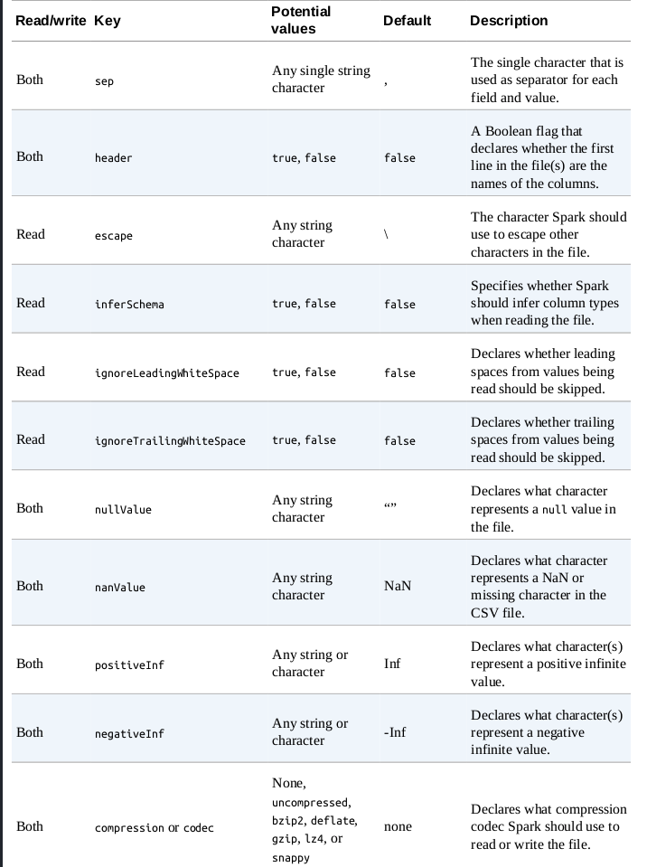
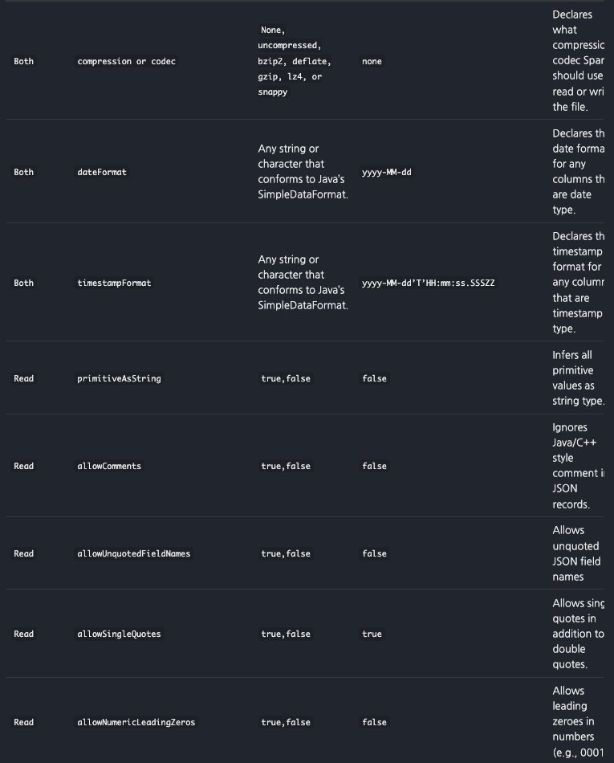
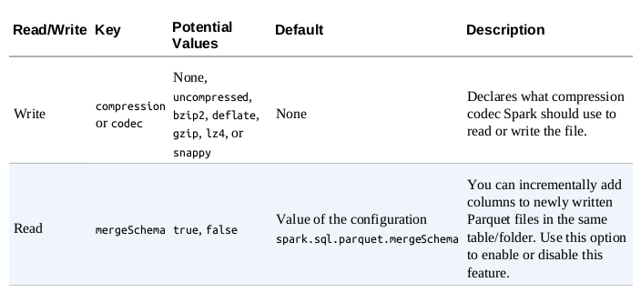
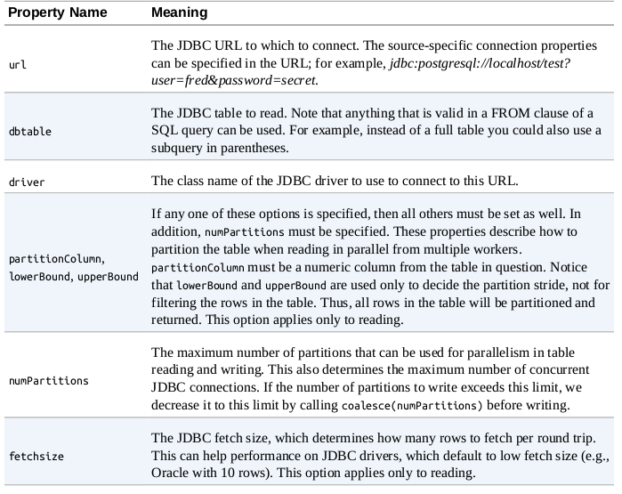
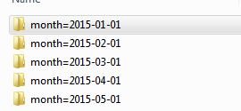

## 9장 데이터소스

```commandline
스파크 핵심 외부 데이터소스
- CSV
- JSON
- PARQUET
- ORC
- JDBC/ODBC
- TEXT FILE
- 파일 옵션
    ㄴ https://spark.apache.org/docs/latest/sql-data-sources-csv.html
```
<br/>

### 9.1 데이터소스 API 구조
#### 읽기 모드
```commandline
데이터 읽기 핵심 구조
- DataFrameReader.format(...).option("key","value").schema(...).load()
- DataFrameReader는 SparkSession의 read 속성으로 접근

읽기 모드 지정 값
- 포맷
- 스키마
- 읽기 모드 
    ㄴ permissive : 오류레코드 null 설정
    ㄴ dropMalformed : 오류레코드 제거
    ㄴ failFast : 오류레코드시 만나면 즉시 종료
- 옵션

예제
spark.read.format("csv")
    .option("mode","FAILFAST")
    .option("inferSchema","true")
    .option("path","path/to/file(s)")
    .schema(someSchema)
    .load()    
```

#### 쓰기 모드
```commandline
데이터 쓰기 핵심 구조
- DataFrameWriter.format(...).option(...).partitionBy(...).bucketBy(...).sortBy(...).save()
- DataFrameWriter는 DataFrame의 write 속성으로 접근

쓰기 모드 지정 값
- 포맷
- 옵션
- 저장 모드
    ㄴ append : 해당 경로에 이미 존재하는 파일 목록에 결과 파일을 추가
    ㄴ overwrite : 이미 존재하는 모든 데이터를 덮어씀
    ㄴ errorIfExists : 해당 경로에 파일이 존재하면 오류 발생
    ㄴ ignore : 해당 경로에 데이터 파일이 존재하면 아무런 처리하지 않음

예제
dataframe.write.format("csv")
    .option("mode","OVERWRITE")
    .option("dataFormat","yyyy-MM-dd")
    .option("path","path/to/file(s)")
    .save()
```
<br/>

### 9.2 CSV 파일
#### CSV 옵션


```commandline
# CSV 읽기
csvFile = spark.read.format("csv")
    .option("header","true")
    .option("mode","FAILFAST")
    .option("inferSchema","true")
    .load("some/path/to/file.csv")

# CSV 쓰기
csvFile.write.format("csv")
    .option("mode","OVERWRITE")
    .option("sep","\t")
    .save("path/to/file(s)")
```
<br/>

### 9.3 Json 파일
```commandline
- 구조화되어 있고, 최소한의 기본 데이터 타입이 존재
```
#### Json 옵션

<br/>

### 9.4 Parquet 파일
```commandline
- 개별 컬럼을 기준으로 읽어 저장공간을 절약하고, 컬럼 기반의 압축 기능 제공
- 스파크 기본 파일 포맷
- 복합 데이터 타입을 지원 ( csv에서는 배열 사용못함 )
- 스파크와 호환이 잘 되기에 옵션이 2개만 존재
```
#### Parquet 옵션

<br/>

### 9.5 ORC 파일
```commandline
- 컬럼 기반의 파일 포맷
- 대규모 스트리밍 읽기에 최적화, 로우를 신속하게 찾아낼 수 있는 기능
- parquet는 spark에 최적화, orc는 hive에 최적화
```
<br/>

### 9.6 SQL Database
```commandline
- 접속 / 인증 및 네트워크 관련 옵션이 필요
- 스파크 classpath에 Database JDBC Driver를 추가하고 적절한 jar 파일을 제공
    ㄴ 예제) ./bin/spark-shell --driver-class-path postgresql-9.4.1.jar --jars postgresql-9.4.1.jar
```
#### JDBC 옵션

<br/>

```commandline
- 데이터 읽기
pgDF = spark.read.format("jdbc")\
  .option("driver", "org.postgresql.Driver")\
  .option("url", "jdbc:postgresql://database_server")\
  .option("dbtable", "schema.tablename")\
  .option("user", "username").option("password", "my-secret-password").load()

- 데이터 쓰기
newPath = "jdbc:sqlite://tmp/my-sqlite.db"
csvFile.write.jdbc(newPath, tablename, mode="overwrite", properties=props)

- 쿼리 푸시다운
    ㄴ DF을 만들기 전에 데이터베이스 자체에서 데이터를 필터링하여 가져 옴
pushdownQuery = """(SELECT DISTINCT(DEST_COUNTRY_NAME) FROM flight_info) AS flight_info"""
dbDataFrame = spark.read.format("jdbc")
  .option("url", url).option("dbtable", pushdownQuery)\
  .option("driver",  driver)\
  .load()
  
- 데이터베이스 병렬로 읽기
    ㄴ numPartitions 옵션을 이용해 읽기/쓰기 동시 작업 수를 제한하는 파티션 수를 설정
dbDataFrame = spark.read.format("jdbc")\
  .option("url", url)\
  .option("dbtable", tablename)\
  .option("driver",  driver)\
  .option("numPartitions", 10).load()
```
<br/>

### 9.8 고급 I/O 개념
```commandline
- 분할 가능한 파일 타입과 압축 방식
 ㄴ 스파크에서 전체 파일이 아닌 쿼리에 필요한 부분만 읽을 수 있어 성능 향상 (parquet file)
 ㄴ 모든 압축 방식이 분할 압축을 지원하지 않음 ( 추천 압축 방식 : GZIP )

- 병렬로 데이터 읽기 
 ㄴ 여러 익스큐터가 같은 파일을 동시에 읽을 수 없지만 여러 파일을 동시에 읽을 수 있음
 ㄴ 다수의 파일을 읽을 때, 개별 파일을 DF의 파티션이 됨
    
- 병렬로 데이터 쓰기
 ㄴ 기본적으로 데이터 파티션 당 하나의 파일이 작성
 ㄴ 폴더 안에 5개의 파일을 생성 - csvFile.repartiton(5).write.format("csv").save("/path/mm.csv")

- 파티셔닝
 ㄴ 어떤 데이터를 어디에 저장할 것인지 제어
 ㄴ 필터를 자주 사용하는 테이블의 경우 손쉬운 최적화 방식
 ㄴ csvFile.limit(10).write.mode("overwrite").partitionBy("DEST_COUNTRY").save("/tmp/partitioned.parquet")
 
- 버켓팅
 ㄴ 각 파일에 저장된 데이터를 제어하는 파일 조직화 기법
 ㄴ 하나의 물리적 파티션에 모여 있어 데이터를 읽을 때 셔플을 피할 수 있음
 ㄴ numBuckets = 100
 csvFile.write.format("parquet").mode("overwrite").bucketBy(numBuckets, "customerId")..saveAsTable("bucket_files")

- 파일 크기 관리
 ㄴ 파일이 자긍면 메타데이터 관리에 부하가 생기며, 파일이 크면 작은 데이터를 부를 때 큰 데이트블록을 읽어야 함
 ㄴ 파일 크기를 제한하는 maxRecordPerFile 통해 파일당 레코드 수 지정
 ㄴ df.write.option("maxRecordPerFile", 5000)
```
<br/>

#### month로 파티셔닝되어 저장

<br/>